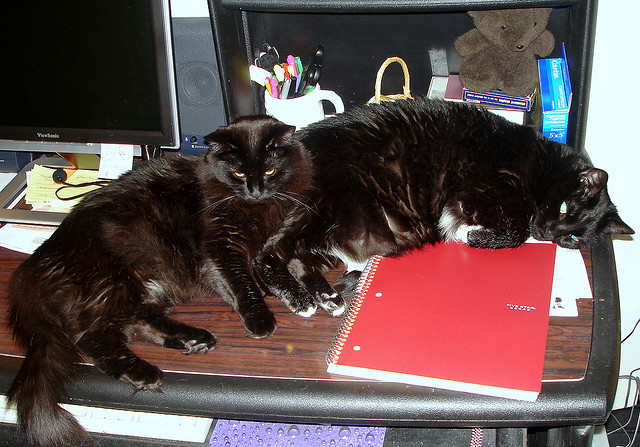

# Student ID, name of each team member.
    106061514 許鈞棠, 106061536 廖學煒 

# Your code and some descriptions.
   ### Hardware:
        CPU:intel i7-7700 GPU: GeForce GTX 1080 Ti 11G

    See cells below

# How did you preprocess your data (if you did it by yourself, not using the method on course notebook)
    >Our method is similar to the course slide

# Do you use pre-trained model ? (word embedding model, CNN model, etc.) 
    >InceptionV3 (GoogleNet)
            The model takes an image as input and it could extract useful information from the given images
            The output feature has dimension (2048,) and it takes about 5 hours to generate all features of 
            the training and testing set of this competition.
    >Word vector glove.6B.100d.txt
            Encoding the word to word vector make it possible to calculate the similarity between two word, 
            which might be useful for traning. This text file consist text to vector dictionary where 6B
            stands for the word vector is training under the dataset with 6 billions word and 100d means the
            word vector dimention is 100 . 
    
# How do you design your image captioning model? (illustrate every step you design and why this works)


   ### Base model:
    
    Since their are plenty of previous works about image caption already exsit on the Internet, I choose one 
    of it (https://github.com/LemonATsu/Keras-Image-Caption) as the baseline model so I don't need to
    spend time on building it from scratch. The author claimed that this model is able to reach 0.76 CiderD
    score. The summary of layers is listed below:

        Layer (type)                    Output Shape         Param #     Connected to
    ==================================================================================================
    input_1 (InputLayer)            (None, 1)            0
    __________________________________________________________________________________________________
    embedding_1 (Embedding)         (None, 1, 100)       315600      input_1[0][0]
    __________________________________________________________________________________________________
    reshape_1 (Reshape)             (None, 100)          0           embedding_1[0][0]
    __________________________________________________________________________________________________
    input_3 (InputLayer)            (None, 53)           0
    __________________________________________________________________________________________________
    concatenate_1 (Concatenate)     (None, 153)          0           reshape_1[0][0]
                                                                     input_3[0][0]
    __________________________________________________________________________________________________
    dense_1 (Dense)                 (None, 100)          15400       concatenate_1[0][0]
    __________________________________________________________________________________________________
    input_2 (InputLayer)            (None, 256)          0
    __________________________________________________________________________________________________
    dropout_1 (Dropout)             (None, 100)          0           dense_1[0][0]
    __________________________________________________________________________________________________
    input_4 (InputLayer)            (None, 3156)         0
    __________________________________________________________________________________________________
    concatenate_2 (Concatenate)     (None, 3512)         0           input_2[0][0]
                                                                     dropout_1[0][0]
                                                                     input_4[0][0]
    __________________________________________________________________________________________________
    reshape_2 (Reshape)             (None, 1, 3512)      0           concatenate_2[0][0]
    __________________________________________________________________________________________________
    gru_1 (GRU)                     (None, 256)          2894592     reshape_2[0][0]
    __________________________________________________________________________________________________
    dropout_2 (Dropout)             (None, 256)          0           gru_1[0][0]
    __________________________________________________________________________________________________
    dense_2 (Dense)                 (None, 256)          65792       dropout_2[0][0]
    __________________________________________________________________________________________________
    batch_normalization_1 (BatchNor (None, 256)          1024        dense_2[0][0]
    __________________________________________________________________________________________________
    activation_1 (Activation)       (None, 256)          0           batch_normalization_1[0][0]
    __________________________________________________________________________________________________
    multiply_1 (Multiply)           (None, 256)          0           input_2[0][0]
                                                                     activation_1[0][0]
    __________________________________________________________________________________________________
    concatenate_3 (Concatenate)     (None, 3512)         0           multiply_1[0][0]
                                                                     dropout_1[0][0]
                                                                     input_4[0][0]
    __________________________________________________________________________________________________
    reshape_3 (Reshape)             (None, 1, 3512)      0           concatenate_3[0][0]
    __________________________________________________________________________________________________
    gru_2 (GRU)                     (None, 1024)         13937664    reshape_3[0][0]
    __________________________________________________________________________________________________
    dropout_3 (Dropout)             (None, 1024)         0           gru_2[0][0]
    __________________________________________________________________________________________________
    dense_3 (Dense)                 (None, 3156)         3234900     dropout_3[0][0]
    __________________________________________________________________________________________________
    batch_normalization_2 (BatchNor (None, 3156)         12624       dense_3[0][0]
    __________________________________________________________________________________________________
    activation_2 (Activation)       (None, 3156)         0           batch_normalization_2[0][0]


   ### Explaination:
        Instead of using LSTM, the model uses two GRU layers to learn sequence information. GRU unit 
    strikes a balance between training accuracy and memory usage (the forget gate and input gate controled 
    the by same variable, thus the total variable count is less than LSTM). Since the max sentence length
    is 53, we use attention method to make model "remember" those word it has look before. The dropout (0.25)
     prevent the model from overfitting and the batchnorm layer make the training process more stable.
     We use softmax layer as activation function since we are predicting the next word and it is an one
     hot vector. Finally, the dense layer is used for connecting two layers with different input size.
     
        Below is our input setup: 
           ### Image feature(256,)
           ### current caption vector [1,47,81,644,....,0]
           ### sequence vec[[1,0,0….,0],[0,1,0...0].....[0,0,1...0]]
           ### Label: next word (3156,)
           ### history: used for attention (cap_len-1,3156)
            [ [0 0 0 ...0 0 0],
              [0 1 0 ...0 0 0],
              [0 1 0 ...1 0 0].....]

    
# Any tricks or techniques you used in this task.


   ### Use joblib to speedup dataloading pipeline
    Joblib is usually faster on large numpy arrays since it has a special handling for the array
    buffers of the numpy datastructure. Moreover, it could boost memory usage efficiency. Since we use
    large batch size(4096) to train our model, it's crucial to load data parallelly to make the most of
    GPU performance.


   ### Beam search 
 
    This algorithm allows RNN to look for multiple path to obtain the highest confidence score. In our 
    competition we set k=6 to obtain the best CiderD score.
   ### Ensemble:
            I propose two ways to ensemble the model:
            1. Use the weights of different epochs
                Since RNN changes it form all the time during the training process, sampling different stage could 
                generate different output. We take advantage of this characteristic, generating multiple output files 
                of the same model. We use beamsearch (k=6) to select the output candidate, and the lowest score (highest
                confidence) sentense will be chosen as output.
                The following list are the output file I used to ensemble:
                    ./out/256_100.csv
                    ./out/demo2048_49.csv
                    ./out/2048_100.csv
                    ./out/2048_105.csv
                    ./out/2048_55.csv
                    ./out/2048_60.csv
                    ./out/bi_97.csv
                    ./out/bi_82.csv
                    ./out/bi_130.csv
                    ./out/bi256_12.csv
                    ./out/bi_134.csv
                    ./out/bi_140.csv
                    ./out/bi_150.csv
                    ./out/bi_200.csv
                where "bi" stands for bidirectional model, the number at the tail of file name indicates epochs
                Our final Cider-D score is 0.886
   ### deal with strange output
            For InceptionV3 output,sometime beamsearch algorithm chooses the sentence with only one word such 
            as "a" "the". In this case, I simply filter those sentences whose word length fewer than 5 words 
            and choose the sentence with second high confidence score.

# Demo: take arbitrary one image and use your model to generate caption for it in your report.


 
   ### PCA256
            321980.jpg: a black cat is sitting on a desk with a keyboard
                    CiderD(0.7411662568390294)
   ### InceptionV3
            321980.jpg,a black cat is sitting on top of a laptop keyboard
                    CiderD(0.08435076883555018)
            If we look at the ground truth of 321980.jpg, the first sentence actually matchs with the image 
            more accurately
            Therefore, under some circumstances PCA256 does outperform InceptionV3 and this is not a rare case
            This give us two possible way to ameliorate the performance of the model:
             1.post process ensembling
             2.concatenate two features and train again, which will be describe below.


# Conclusions (interesting findings, pitfalls, takeaway lessons, etc.)


   ### Result:
    The input feature I've tried:
        >InceptionV3 (2048,)
            This feature could reach 0.78 CiderD score with the default setting
            >Changing both GRU layers to bidirectional 
                Some words in English could depend on the previous word, for example, an +(a/i/u/e/o)
                Based on this assumption, I change the GRU layer to bidirectional and got a better result
                ( 0.82 CiderD, 100 epochs, batch size= 4096)
            >Add the activation function after three dense layer
                >Relu, Sigmoid
                Unfortunately, the model doesn't perform well since the loss stop to decrease in the middle 
                stage (50~70 epochs). The CiderD score is also unattractive(0.69)
        >PCA256 (256,)
            Best score: 0.74
            Although the performance is far behind InceptionV3 , it seems that this feature contains different 
            information so the output sentence structure is different from which of InceptionV3. For instance:
            


        >InceptionV3+PCA256(2304,)
            Unfortunately, the loss saturated after 50~70 epochs of training and the CiderD score is 0.75 at the 
            best case.

   ### RNN: Does RMSprop better than Adam?

    Some expert suggests that RMSprop is a better selection over adam when it comes to training the RNN neural network.
    In order to validate this statement, I tried both optimizer in this competition. The result is consistent with the 
    statement in this case. Adam's loss stop to decrease after 50~70 epochs while RMSprop keeps going down. However,
    is there any exception? I've tested a simple GRU model to predict the addition of two input numbers.
    (source code:https://github.com/BeyondCloud/DL/blob/master/GRU_lab.ipynb)
    In this case, Adam descends faster than RMSprop.Plus, Adam almost reach the global minimun while RMSprop don't.
    Consequently,there's no guarantee that one optimizer outperform the other one. We should try both to 
    

   ### Is CiderD score fair or not
   
    If the generate caption include word not exist in the ground truth, the sentense will get poor score even it 
    matches the image well. Even the caption is written by human, there is no gaurantee that it could get a high
    score. Afterall, evalutating sentence quality is not a simple task. In general, CiderD score work good. I've
    try concatenating two sentence using "and". However, this will get a poor score since CiderD will give penalty
    to the length of sentence
    
   ### Low validation loss does not indicate high CiderD score 
    
    I found that my model generate best CiderD score after 100~150 epochs of training. When the validation loss
    becomes lower, the CiderD score drop precipitately. Again , this shows that CiderD score may not be the best
    evaluation method for image caption


## Train


```python
import os, sys
import _pickle as cPickle
import urllib.request

import pandas as pd
import scipy.misc
import numpy as np

from keras.models import load_model
from utils import *
from model import image_caption_model
from joblib import Parallel, delayed
import time
from keras.utils.layer_utils import print_summary

from keras.backend.tensorflow_backend import set_session
import tensorflow as tf
config = tf.ConfigProto()
# config.gpu_options.per_process_gpu_memory_fraction = 0.3
config.gpu_options.allow_growth = True
set_session(tf.Session(config=config))

def gen_batch_in_thread(img_map, df_cap, vocab_size, n_jobs=4,
        size_per_thread=32):
    imgs , curs, nxts, seqs, vhists = [], [], [], [], []
    returns = Parallel(n_jobs=4, backend='threading')(
                            delayed(generate_batch)
			    (img_train, df_cap, vocab_size, size=size_per_thread) for i in range(0, n_jobs))

    for triple in returns:
        imgs.extend(triple[0])
        curs.extend(triple[1])
        nxts.extend(triple[2])
        seqs.extend(triple[3])
        vhists.extend(triple[4])

    return np.array(imgs), np.array(curs).reshape((-1,1)), np.array(nxts), \
            np.array(seqs), np.array(vhists)

def generate_batch(img_map, df_cap, vocab_size, size=32, max_caplen=53):
    imgs, curs, nxts, seqs, vhists = [], [], [], [], []

    for idx in np.random.randint(df_cap.shape[0], size=size):
        row = df_cap.iloc[idx]
        cap = eval(row['caption'])

        if row['img_id']not in img_map.keys():
            continue

        img = img_map[row['img_id']]
        vhist = np.zeros((len(cap)-1, vocab_size))

        for i in range(1, len(cap)):
            seq = np.zeros((max_caplen))
            nxt = np.zeros((vocab_size))
            nxt[cap[i]] = 1
            curs.append(cap[i-1])
            seq[i-1] = 1

            if i < len(cap)-1:
                vhist[i, :] = np.logical_or(vhist[i, :], vhist[i-1, :])
                vhist[i, cap[i-1]] = 1

            nxts.append(nxt)
            imgs.append(img)
            seqs.append(seq)

        vhists.extend(vhist)

    return imgs, curs, nxts, seqs, vhists

if __name__ == '__main__':

    # initialization
    hist_path = 'history/'
    mdl_path = 'weights/'

    # read pkl
    dec_map = cPickle.load(open('dataset/text/dec_map.pkl', 'rb'))
    enc_map = cPickle.load(open('dataset/text/enc_map.pkl', 'rb'))

    img_train = cPickle.load(open('dataset/train_img2048.pkl', 'rb'))
    # img_train = pd.DataFrame(list(img_train.items()), columns=['img_id', 'img'])

    img_train = { i[0] : i[1] for i in img_train }
    # img_train = pd.DataFrame({'img_id': [i[0] for i in img_train],'img':[i[1] for i in img_train]}).set_index(['img_id'])

    df_cap = pd.read_csv('dataset/text/train_enc_cap.csv')

    vocab_size = len(dec_map)
    embedding_matrix = generate_embedding_matrix('pretrained/glove.6B.100d.txt', dec_map)
    model = image_caption_model(vocab_size=vocab_size, embedding_matrix=embedding_matrix,img_dim = 2048)

    if len(sys.argv) >= 2:
        print('load weights from : {}'.format(sys.argv[1]))
        model.load_weights(sys.argv[1])

    # insert ur version name here
    version = 'v1'
    batch_num = 70
    # print_summary(model.layers)

    hist_loss = []

    for i in range(0, 100):
        for j in range(0, batch_num):
            s = time.time()
	    # 64 x 128 = 8192 images per batch.
	    # 8 x 32 = 256 images for validation.
            img1, cur1, nxt1, seq1, vhists1 = gen_batch_in_thread(img_train, df_cap,
                                    vocab_size, n_jobs=32, size_per_thread=128)
            # img2, cur2, nxt2, seq2, vhists2 = gen_batch_in_thread(img_train, df_cap, 
            #                         vocab_size, n_jobs=2, size_per_thread=8)

            hist = model.fit([img1, cur1, seq1, vhists1], nxt1, batch_size=4096,epochs=1, verbose=0, shuffle=True)
            # hist = model.fit([img1, cur1, seq1, vhists1], nxt1, batch_size=4096, nb_epoch=1, verbose=0,
            #                         validation_data=([img2, cur2, seq2, vhists2], nxt2), shuffle=True)

            # print("epoch {0}, batch {1} - training loss : {2}, validation loss: {3}"
            #         .format(i, j, hist.history['loss'][-1], hist.history['val_loss'][-1]))
            print("epoch {0}, batch {1} - training loss : {2}".format(i, j, hist.history['loss'][-1]))
	    # record the training history
            hist_loss.extend(hist.history['loss'])

            if (j+1) % int(batch_num / 2) == 0 :
                print('check point')
                # m_name = "{0}{1}_{2}_{3}_{4}.h5".format(mdl_path, version, i, j, time.time())
                # model.save_weights(mdl_path+'ep59_2048.h5')
                model.save_weights(mdl_path+'bi_.h5')
                cPickle.dump({'loss':hist_loss}, open(hist_path+ 'history.pkl', 'wb'))


```

# Evaluate


```python
from keras.applications.inception_v3 import InceptionV3
from model import image_caption_model
from keras.models import load_model
from keras.optimizers import RMSprop, Adadelta, SGD
from keras.utils.layer_utils import print_summary
from keras.preprocessing import image
from keras.applications.inception_v3 import preprocess_input
from utils import *
import scipy.misc
import numpy as np
import pandas as pd
import _pickle as cPickle

from extractor import ImageFeatureExtractor
from keras.backend.tensorflow_backend import set_session
import tensorflow as tf
from tqdm import tqdm
config = tf.ConfigProto()
# config.gpu_options.per_process_gpu_memory_fraction = 0.3
config.gpu_options.allow_growth = True
set_session(tf.Session(config=config))
def generate_k_best(model, enc_map, dec_map, img, k=4, max_len=10):
    ans,score = bs(model, enc_map, dec_map, img, k, max_len)
    gen = []
    for x in ans:
        if x == 1 : break
        if x != 0 : gen.append(dec_map[x])
    return  ' '.join(gen),score
class ImageCaptionModel(object):

    def __init__(self, w_path, dec_path='dataset/text/dec_map.pkl',
                    enc_path='dataset/text/enc_map.pkl',
                    embedding_path='pretrained/glove.6B.100d.txt'):

        dec_map = cPickle.load(open(dec_path, 'rb'))
        enc_map = cPickle.load(open(enc_path, 'rb'))
        vocab_size = len(dec_map)
        print('vocab size:',vocab_size)
        embedding_matrix = generate_embedding_matrix(embedding_path, dec_map)
        self.model = image_caption_model(vocab_size=vocab_size,embedding_matrix=embedding_matrix,img_dim = 256)

        # self.extractor = ImageFeatureExtractor('model/tensorflow_inception_graph.pb')
        self.model.load_weights(w_path)
        self.dec_map = dec_map
        self.enc_map = enc_map

    def predict(self, img_feature):
        # img_feature = self.extractor.extract_features(img_path, flag_from_file=True)
        #print(img_feature)
        sentence = generate_k_best(self.model, self.enc_map, self.dec_map, img_feature, k=6, max_len=15)
        return sentence

if __name__ == '__main__':
    print('Initializing ...')

    # loading feature
    import sys
    weights = sys.argv[1]
    image_caption = ImageCaptionModel(weights)
    img_test = cPickle.load(open('dataset/test_img256.pkl', 'rb'))
    img_test_df = pd.DataFrame(list(img_test.items()), columns=['img_id', 'img'])
    img_ids, caps = [], []
    img_ids, caps,scores = [], [] ,[]
    # for i in tqdm(range(len(img_test_df.values))):
    for i in tqdm(range(10)):
        
        # print(img_test_df.values[i][0])
        img_ids.append(img_test_df.values[i][0])
        sentence,score = image_caption.predict(img_test_df.values[i][1])
        caps.append(sentence)
        scores.append(score)
    df_predict = pd.DataFrame({
                'img_id': img_ids,
                'caption': caps,
                'score':scores
                }).set_index(['img_id'])
    # df_predict.to_csv('out/bi256_.csv')
    df_predict.to_csv('out/foo256_.csv')
    

```

# Beamsearch


```python
import numpy as np

def beamsearch(model, enc_map, dec_map, img, k=4, max_len=10):

    use_unk = False
    oov = enc_map['<RARE>']
    empty = enc_map['<ST>']
    eos = enc_map['<ED>']

    dead_k = 0 # samples that reached eos
    dead_samples = []
    dead_scores = []
    live_k = 1 # samples that did not yet reached eos
    live_samples = [[empty]]
    live_scores = [0]

    cnt = 0
    while live_k and dead_k < k:
        # for every possible live sample calc prob for every possible label
        lang_input = [live_samples[r][-1] for r in range(0, len(live_samples))]
        img_input  = np.tile(np.array([img]), (len(lang_input),1))
        # vhists = np.zeros((len(lang_input), 2187))
        vhists = np.zeros((len(lang_input), 3156))
        
        seqs = np.zeros((len(live_samples), 53))

        for r in range(0, len(live_samples)):
            url = unroll(live_samples[r][0])
            idx = len(url)-1
            seqs[r, idx] = 1
            vhists[r, np.array(url)] = 1
            X = [img_input, np.array(lang_input).reshape(-1,1), seqs, vhists]

        probs = model.predict(X)[0]

        # total score for every sample is sum of -log of word prb
        cand_scores = np.array(live_scores)[:,None] - np.log(probs)

        if not use_unk and oov is not None:
            cand_scores[:,oov] = 1e20
        cand_flat = cand_scores.flatten()

        # find the best (lowest) scores we have from all possible samples and new words
        ranks_flat = cand_flat.argsort()[:(k-dead_k)]
        live_scores = cand_flat[ranks_flat]

        # append the new words to their appropriate live sample
        voc_size = len(probs)
        n_livesample = []
        live_samples = [[unroll(live_samples[r//voc_size])]+[r%voc_size] for r in ranks_flat]

        # live samples that should be dead are...
        zombie = [s[-1] == eos or len(s[0]) >= max_len for s in live_samples]

        # add zombies to the dead
        dead_samples += [s for s,z in zip(live_samples,zombie) if z]  # remove first label == empty
        dead_scores += [s for s,z in zip(live_scores,zombie) if z]
        dead_k = len(dead_samples)
        # remove zombies from the living
        live_samples = [s for s,z in zip(live_samples,zombie) if not z]
        live_scores = [s for s,z in zip(live_scores,zombie) if not z]
        live_k = len(live_samples)

    scores = dead_scores + live_scores
    samples = dead_samples + live_samples

    sorted_idx = np.argsort(np.array(scores))
    idx = sorted_idx[0]
    iii = 1
    try:
        while len(samples[idx][0])<5:
            idx = sorted_idx[iii]
            iii+=1
    except:
        idx = 0

    answer = unroll(samples[idx])
    return answer,scores[idx]

def unroll(l):
    x = []

    if type(l) == int:
        return [l]
    for i in l:
        if type(i) == list:
            for v in i :
                x.append(v)
        else: x.append(i)

    return x


```

# Model


```python
from keras.models import Model
from keras.layers import Bidirectional,Input, Dense, Embedding, Reshape, GRU, concatenate, LSTM, Dropout, BatchNormalization, Activation,multiply
# from keras.optimizers import RMSprop
from keras.optimizers import Adam,SGD,RMSprop,Adadelta


def image_caption_model(vocab_size=2187, embedding_matrix=None, lang_dim=100,
            max_caplen=53, img_dim=2048, clipnorm=1):
    print('generating vocab_history model v5')
    # text: current word
    lang_input = Input(shape=(1,))
    img_input = Input(shape=(img_dim,))
    seq_input = Input(shape=(max_caplen,))
    vhist_input = Input(shape=(vocab_size,))

    if embedding_matrix is not None:
        x = Embedding(output_dim=lang_dim, input_dim=vocab_size, init='glorot_uniform', input_length=1, weights=[embedding_matrix])(lang_input)
    else:
        x = Embedding(output_dim=lang_dim, input_dim=vocab_size, init='glorot_uniform', input_length=1)(lang_input)

    lang_embed = Reshape((lang_dim,))(x)
    lang_embed = concatenate([lang_embed, seq_input])
    lang_embed = Dense(lang_dim)(lang_embed)
    lang_embed = Dropout(0.15)(lang_embed)

    merge_layer = concatenate([img_input, lang_embed, vhist_input])
    merge_layer = Reshape((1, lang_dim+img_dim+vocab_size))(merge_layer)

    gru_1 = Bidirectional(GRU(img_dim))(merge_layer)
    gru_1 = Dropout(0.15)(gru_1)
    gru_1 = Dense(img_dim)(gru_1)
    gru_1 = BatchNormalization()(gru_1)
    gru_1 = Activation('softmax')(gru_1)

    attention_1 = multiply([img_input, gru_1])
    attention_1 = concatenate([attention_1, lang_embed, vhist_input])
    attention_1 = Reshape((1, lang_dim + img_dim + vocab_size))(attention_1)

    gru_2 = Bidirectional(GRU(1024))(attention_1)
    gru_2 = Dropout(0.15)(gru_2)
    gru_2 = Dense(vocab_size)(gru_2)
    gru_2 = BatchNormalization()(gru_2)

    out = Activation('softmax')(gru_2)

    model = Model(input=[img_input, lang_input, seq_input, vhist_input], output=out)

    # model.compile(loss='categorical_crossentropy', optimizer=Adam(lr=0.0001,beta_1=0.6, beta_2=0.5,epsilon = 0.1))
    model.compile(loss='categorical_crossentropy', optimizer=RMSprop(lr=0.000001, clipnorm=1.0))
    # model.summary()
    return model


```
